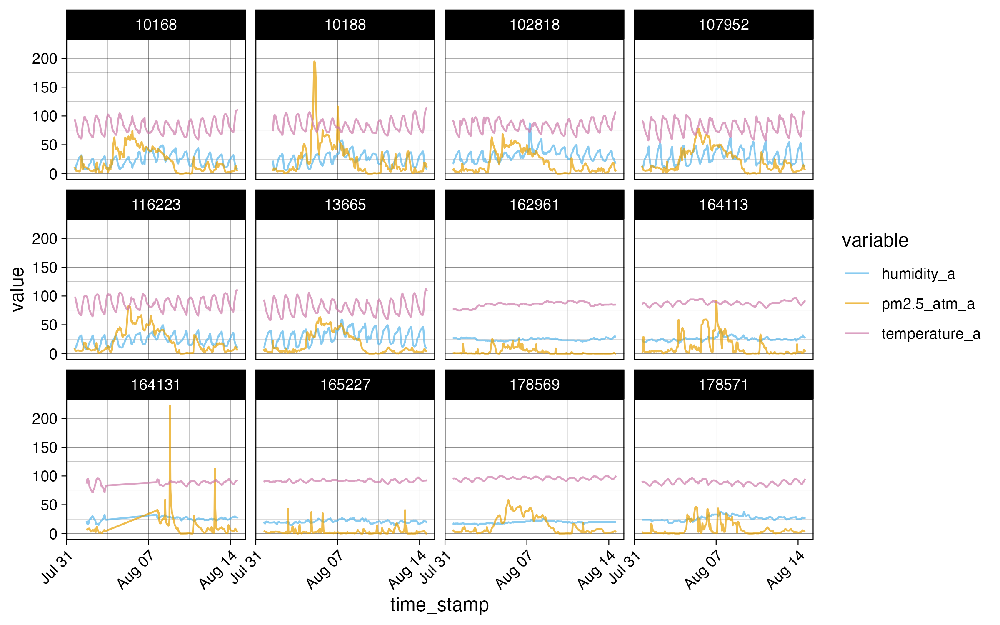

# get_pa_csv

Example of using R to get PurpleAir data as CSV files for multiple stations.

## Overview

This example shows how data can be retrieved from PurpleAir using R and a scheduled task.

- *get_data.R* is the R script which gets the data
- *read_data.R* is the R script which reads all of the data files and makes a simple plot.
- *run_daily.sh* is a Bash script to run get_data_v2.R and is executed by the cron utility
- *crontab.txt* is the crontab entry to run the Bash script

The two R scripts have been tested to work on Windows, macOS, and Ubuntu Linux. The Bash script and crontab file are intended to be used on a Linux server and are not needed to run the R scripts from RStudio.
 
## Usage

The steps below assume you are using this on a Linux, Unix, or macOS system that has the "cron" utility installed and the Bash shell.
 
1. Put all of these files in a single folder, preferably an RStudio Project folder.
2. Edit the settings in the "Initialize variables" section of *get_data.R* to suit your needs.
3. Edit the folder path in *run_daily.sh* and *crontab.txt* to match the folder path that stores these files.
4. Edit the first line of *run_daily.sh* to correct the path to the Bash interpreter, if necessary.
5. Edit the file paths in *run_daily.sh* for the *date* and *Rscript* utilities, if necessary.
6. Edit *crontab.txt* for the schedule you want (or leave as-is for midnight every day).
7. Run the following Bash commands at the Bash (Terminal) prompt:
```
chmod +x run_daily.sh
crontab -l > old_crontab.txt
cat old_crontab.txt crontab.txt > new_crontab.txt
crontab new_crontab.txt
```
8. Confirm your *crontab* entry has been stored with:
```
crontab -l
```
9. Either wait for *cron* to run your script or run it manually from Bash with:
```
bash ./run_daily.sh
```

## Results

CSV files will be stored in a data folder called "data" or whatever you have
specified in the setup in *get_data.R* as the variable *data_dir*. There will 
be one CSV file per station. The CSV files will grow in size as new data is 
appended to them by *get_data.R* on subsequent executions.

If you run the R script from the Bash script (*run_daily.sh*), then you should
see a log file (*get_data_log.txt*) with an entry for each execution attempt. 
Errors and warnings may appear after the timestamp for each attempt if the 
script encountered difficulties getting the data.

An example plot from running *read_data.R* is shown below:



Additionally, sensor information will be written to a CSV file called 
*sensor_info.csv* which can be found in your *data_dir* folder. This file 
will be overwritten each time *get_data.R* is successfully run.
